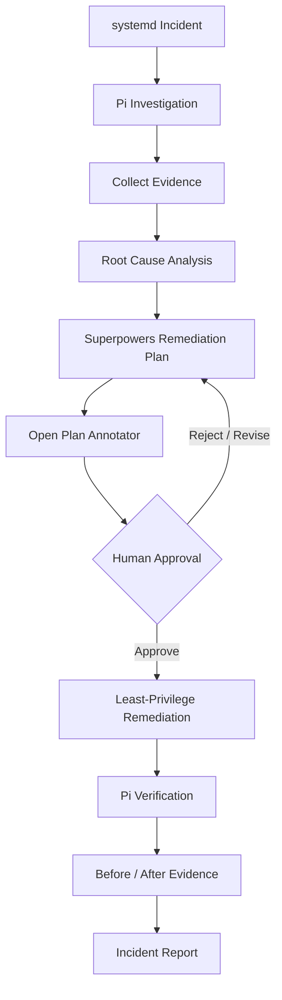
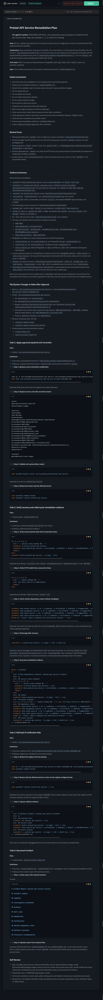

# Agentic Linux Incident Responder

A hands-on **Agentic SRE lab** demonstrating how an AI agent can investigate a Linux service failure, preserve evidence, identify the root cause, propose a remediation plan for human approval, execute an approved least-privilege fix, verify recovery, and document the incident.

The project runs on **RHEL 9.8** and uses **Pi, Superpowers, Open Plan Annotator, systemd, Bash, sudo controls, Git, and GitHub**.


## The Incident

A lab systemd service called `pretzel-api.service` was intentionally configured with:

```ini
ExecStart=/opt/pretzel/bin/pretzel-api
```

The systemd service existed, but the executable it was configured to start did not.

As a result, systemd repeatedly failed with:

```text
status=203/EXEC
Failed to locate executable /opt/pretzel/bin/pretzel-api
```

The goal was not simply to fix the service manually.

The goal was to build an **agentic incident-response workflow** where the AI agent:

- investigates first
- gathers evidence
- identifies the root cause
- creates a remediation plan
- waits for human approval
- performs only the approved change
- verifies recovery
- preserves before/after evidence
- produces an incident report

---

## Agentic SRE Workflow



The workflow follows:

**Incident → Investigation → Evidence → Root Cause → Plan → Human Review → Approved Remediation → Verification → Evidence → Incident Report**

If the proposed remediation is rejected or needs changes, the workflow returns to the planning stage before any system modification is made.

---

## Investigation

Pi began with **read-only investigation**.

It inspected:

- systemd service status
- journal logs
- systemd unit configuration
- executable paths
- filesystem state
- permissions
- relevant services
- listening ports
- SELinux state

The evidence showed:

```text
pretzel-api.service
        |
        v
ExecStart=/opt/pretzel/bin/pretzel-api
        |
        v
Executable does not exist
        |
        v
systemd 203/EXEC
```

The root cause was therefore clear:

> `pretzel-api.service` was configured to execute `/opt/pretzel/bin/pretzel-api`, but that executable did not exist.

---

## Human-in-the-Loop Governance

One of the most useful parts of this project happened during investigation.

Pi discovered a separate real Pretzel Shop application under:

```text
/home/devopsy/pretzel-shop
```

It initially proposed using that existing application to satisfy the failing service.

That solution was technically plausible, but it was **outside the scope of the lab**.

The remediation plan was rejected during human review.

Pi then produced a revised plan that kept the incident completely isolated from the real Pretzel Shop application.



The approved plan required that:

- the existing systemd unit remain unchanged
- only the missing lab executable be created
- the real Pretzel Shop application remain untouched
- SELinux remain enabled
- the firewall remain enabled
- no unnecessary packages be installed
- rollback steps be documented
- recovery be verified before declaring success

This demonstrated an important principle:

> Agent autonomy should be constrained by scope, permissions, approval gates, and verification.

---

## Least-Privilege Privileged Execution

Pi's execution environment could not interactively enter a sudo password.

Instead of running the entire agent as root or granting:

```text
NOPASSWD: ALL
```

the project used a narrowly scoped, root-controlled remediation helper:

```text
/usr/local/sbin/pretzel-lab-remediate
```

Pi was authorized to execute only:

```bash
sudo -n /usr/local/sbin/pretzel-lab-remediate
```

A copy of the helper is included in this repository:

```text
scripts/pretzel-lab-remediate
```

The privilege model became:

```text
Pi
 |
 v
sudo -n
 |
 v
Approved remediation helper
 |
 v
Specific privileged system changes
```

rather than:

```text
Pi --> unrestricted root access
```

This allowed the agent to perform the final remediation while maintaining a clear privilege boundary.

---

## Remediation

After human approval, Pi executed the approved helper.

The remediation:

1. backed up the systemd unit
2. created `/opt/pretzel/bin`
3. created the missing `/opt/pretzel/bin/pretzel-api`
4. set ownership to `root:root`
5. set permissions to `0755`
6. restarted only `pretzel-api.service`

The original unit configuration remained unchanged:

```ini
[Service]
Type=simple
ExecStart=/opt/pretzel/bin/pretzel-api
Restart=on-failure
RestartSec=3
```

---

## Verification

The agent did not treat a successful `systemctl restart` command as proof that the incident was resolved.

It verified the actual service state three consecutive times.

The final state showed:

```text
ActiveState=active
SubState=running
Result=success
ExecMainStatus=0
```

The journal also showed:

```text
pretzel-api lab service started
```

No new `203/EXEC` failures appeared after the remediation.

This completed the full incident-response loop:

```text
Broken
  ↓
Investigated
  ↓
Root cause identified
  ↓
Plan reviewed
  ↓
Approved remediation executed
  ↓
Service verified
  ↓
Evidence preserved
```

---

## Auditable Evidence

The project preserves evidence from both sides of the incident:

```text
evidence/
├── before.txt
└── after.txt
```

### `evidence/before.txt`

Contains proof of the broken state, including:

- failing systemd status
- `203/EXEC`
- journal errors
- missing executable
- original `ExecStart`
- relevant system state

### `evidence/after.txt`

Contains proof of recovery, including:

- the final agent-executed remediation command
- executable ownership and permissions
- unchanged systemd configuration
- three successful service checks
- `ActiveState=active`
- `SubState=running`
- `Result=success`
- post-remediation journal output

This avoids relying on the agent simply claiming:

> "The incident is fixed."

The repository contains objective proof of both the failure and the recovery.

---

## Incident Report

The final incident report is available here:

[`reports/incident-report.md`](reports/incident-report.md)

It documents:

- incident summary
- symptoms
- investigation
- evidence
- root cause
- remediation
- verification
- rollback procedure
- scope controls
- preventive recommendation

---

## Repository Structure

```text
.
├── README.md
├── docs/
│   ├── screenshots/
│   │   ├── agentic-sre-workflow.png
│   │   └── plan-review.png
│   └── superpowers/
│       └── plans/
│           └── 2026-10-06-pretzel-api-remediation.md
├── evidence/
│   ├── before.txt
│   └── after.txt
├── reports/
│   └── incident-report.md
└── scripts/
    └── pretzel-lab-remediate
```

---

## Tools Used

- **RHEL 9.8** — Linux operating environment
- **systemd** — service management
- **journalctl** — incident logs and verification
- **Pi** — agent performing investigation, remediation, and verification
- **Superpowers** — systematic debugging and structured planning
- **Open Plan Annotator** — human review and approval gate
- **Bash** — lab executable and remediation helper
- **sudo / sudoers** — least-privilege privileged execution
- **Git / GitHub** — version control and portfolio documentation

---

## What I Learned

This project was less about fixing one broken systemd service and more about understanding how an AI agent should operate around infrastructure.

The main lessons were:

- investigation should begin read-only
- evidence should come before conclusions
- technically valid actions can still be out of scope
- human approval matters before privileged changes
- AI agents should not automatically receive unrestricted root access
- least-privilege execution can allow automation without giving away full control
- a successful command is not the same as successful recovery
- verification should prove the actual system state
- before/after evidence makes the workflow auditable
- rollback should be part of the remediation plan
- human governance can stop an agent from making a technically plausible but inappropriate change

---

## Project Status

**Project 1 — Complete**

This is the first project in a progressive Agentic SRE learning series.

Future projects will extend the same operating model into:

- AWS incident investigation
- AWS remediation with human approval
- Infrastructure as Code
- multi-agent operations
- AWS-native agent services
- Kubernetes / EKS
- a larger Agentic SRE platform built around the Pretzel Shop application
